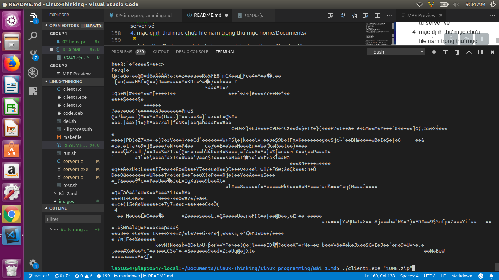
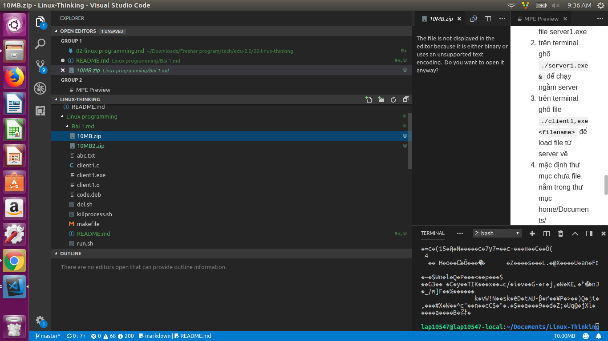

## Những gì đã làm được:
-  [x] client load file từ server 
-  [x] Xử lý được multiclients dựa vào thread

Xử lý tại client
```#include <sys/types.h>
#include <sys/socket.h>
#include <stdio.h>
#include <netinet/in.h>
#include <arpa/inet.h>
#include <unistd.h>
#include <stdlib.h>
#include <string.h>
int main(int argc, char *argv[])
{
    int sockfd;
    int len;
    struct sockaddr_in address;
    int result;
    char buffer[256];
    sockfd = socket(AF_INET, SOCK_STREAM, 0);

    // khai báo tên domain mà socket sẽ dung
    address.sin_family = AF_INET;                     
    address.sin_addr.s_addr = inet_addr("127.0.0.1");    //địa chỉ ip server,
    address.sin_port = htons(9734);                   //port sẽ sử dụng để giao tiếp
    len = sizeof(address);

    result = connect(sockfd, (struct sockaddr *)&address, len);
    if (result == -1) // nếu thiết lập kết nối thất bại
    {
        perror("oops: client1");
        exit(1);
    }

    char *filename = argv[1]; //lấy tên file mà client muốn down
    ssize_t numBytesRecv = 0;//số lượng byte nhận từ server 
     //gửi kết nối tới server với message là tên file
    send(sockfd, filename, strlen(filename), 0);

    printf("[+] Client's waiting download file %s\n", filename);

    FILE *fp = fopen(filename, "wb");

    do
    {
        numBytesRecv = recv(sockfd, buffer, 256, 0);
        printf("%s\n", buffer);
        if (numBytesRecv == 0)
            break;
        fwrite(buffer, 1, numBytesRecv, fp); // ghi tưngf byte được nhận vào file
        memset(&buffer, 0, sizeof(buffer)); //làm sạch buffer
    } while (numBytesRecv > 0);

    fclose(fp); //đóng file 
    close(sockfd); //đóng kết nối socket
    exit(0);
}

```
Xử lý tại server

```#include <sys/types.h>
#include <sys/socket.h>
#include <stdio.h>
#include <netinet/in.h>
#include <arpa/inet.h>
#include <unistd.h>
#include <stdlib.h>
#include <string.h>
#include <pthread.h>
void *sendFile(void *);
struct thread_args
{
    char filePath[256];
    int sock;
};

int main()
{
    char buffer[256];
    char filepath[256];
    char sendbuffer[1000];
    int b;
    int server_sockfd, client_sockfd, *new_sock; //tạo 2 socket server và client
    int server_len, client_len;
    struct sockaddr_in server_address;
    struct sockaddr_in client_address;

    server_sockfd = socket(AF_INET, SOCK_STREAM, 0);
    server_address.sin_family = AF_INET;                //kiểu domain cho socket server
    server_address.sin_addr.s_addr = htonl(INADDR_ANY); //chấp nhận kết nối từ tất cả địa chị client
    server_address.sin_port = htons(9734);              // port mà socket server sẽ kết nối
    server_len = sizeof(server_address);
    bind(server_sockfd, (struct sockaddr *)&server_address, server_len); //bind server socket với địa chỉ server
    listen(server_sockfd, 5);
    FILE *fp;
    if (fp == NULL)
    {
        fprintf(stderr, "file không tồn tại");
        return 1;
    }

    while (1)
    {

        char ch;
        printf("server waiting\n");
        client_len = sizeof(client_address);
        client_sockfd = accept(server_sockfd, (struct sockaddr *)&client_address, &client_len);
        if (client_sockfd > 0)
        {

            recv(client_sockfd, buffer, 256, 0);
            pthread_t sniffer_thread;
            new_sock = malloc(sizeof *new_sock);
            struct thread_args *thread_data = malloc(sizeof *thread_data);
            strcpy(thread_data->filePath, "/home/lap10547/Documents/");
            strcat(thread_data->filePath, buffer);
            thread_data->sock = client_sockfd;

            if (pthread_create(&sniffer_thread, NULL, sendFile, (void *)thread_data) < 0)
            {
                perror("could not create thread");
                return 1;
            }
            memset(&buffer, 0, sizeof(buffer));
        }
    }
}
void *sendFile(void *client_sockfd)
{
    struct thread_args thread_agr = *(struct thread_args *)client_sockfd;
    printf("slient_sockfd:  %d %s\n", thread_agr.sock, thread_agr.filePath);
    char sendbuffer[1000];
    int b;
    FILE *fp;
    char filepath[256];
    strcpy(filepath, thread_agr.filePath);
    //printf("filepath received from     client: %s\n", filepath);
    fp = fopen(filepath, "rb");
    while ((b = fread(sendbuffer, 1, sizeof(sendbuffer), fp)) > 0)
    {
        send(thread_agr.sock, sendbuffer, b, 0);
    }
   
    fclose(fp);
    free(client_sockfd);
    close(thread_agr.sock);
    pthread_exit(NULL);
}
```

### cách build:
1. Chạy file make file `make` để tạo ra file client1.exe và file server1.exe
2. trên terminal ghõ `./server1.exe &` để chạy ngầm server
3. trên terminal ghõ file `./client1,exe <filename>` để load file từ server về
4. mặc định thư mục chưa file nằm trong thư mục home/Documents/

* ví dụ tải 2 file `10MB.zip` và  `10MB2.zip` cùng lúc , 2 file này đều nặng 10MB sau khi tải xong thì file đó sẽ nằm trong Thư mục Bài 1

    * Trên terminal 1 
    

     * Trên terminal 1 
    
    
    * sau khi dowload xong, 2 file vừa tải về sẽ nằm ở thư mục bài 1
    
