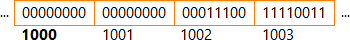

# README
## I. Socket
1. Định nghĩa
- Định nghĩa:  một socket là 1 kĩ thuật giúp cho hệ thống client/server có thể giao tiếp được với nhau, bất kể trên một máy tính đơn, hoặc giữa các máy tính có liên kết mạng với nhau.
- <b>Hoạt động tại server:</b> thông thường server chạy trên một máy tính và có hệ điều hành chạy bên dưới. Các chương trình trên server sẽ có một socket liên kết mới một port. Theo đó, Socket này sẽ chờ đợi, lắng nghe các kết nối từ client gửi đến và đáp trả.
- <b>Hoạt động lại cilent</b> Cũng giống như server, client cũng sẽ có một socket, socket này sẽ tạo một kết nối tới server. Đối với các chương trinh trên cùng 1 máy tính, các socket giữa các chương trình này sẽ giao tiếp với nhau thông qua một file descroptor. Còn đối với các chương trình thuộc máy tính khác nhau(client/server) thì giao tiếp với nhau qua mạng, Để làm được điều này client cần phải biết được địa chỉ Id của server và port number để giao tiếp 
 socket domain chỉ định network medium mà socket sẽ sử dụng,
- Bên dưới là hỉnh ảnh mô tả các bước mà một client sẽ giao tiếp với 1 server
- 

 ví dụ AF_INET
 
 2. Các kiểu socket
* Stream sockets: Cung cấp một connection liên tục, dữ liệu được truyền một cách tin cậy. Dữ liệu được truyền bằng cách này sẽ không bị mất, trùng lặp. Đặc biệt là client muốn giao tiết với server thì bắt buộc client phải thiết lập một kết nối tới server.
* Datagram: ngược lại với stream socket. Client không cần thiết lập kết nối với server, Dữ liệu được truyền theo cách này sẽ bị giới hạn size được gửi, dễ bị thất lạc, bị trùng lặp.  Đặc biệt kiểu kết nối này nhanh bởi vì không cần thiết lập kết nối ban đầu với server.

4. Nonblocking/blocking socket

* socket blocking là hiện tượng xảy ra khi một socket đang thực hiện một lời gọi I/O cho một client. Các connections từ các client khác sẽ phải chờ cho tới khi socket đó thực thiện xong lời gọi I/O cho client đang giao tiếp với nó.

* Socket nonblocking thì một socket sẽ không chờ cho tới khi lời gọi I/O cho một client được hoàn thành. thay vào đó nó sẽ thự hiện lời gọi I/O từ nhiều client khác.

5. Network byte order
- Không phải tất cả các máy tính đều lưu trữ các bytes theo một thứ tự giống nhau. Khi giá trị một số cần nhiều hơn 1 bytes để lưu trữ, thì có 2 cách thông dụng để lưu trữ giá trị
    * big-endian: Các bit có trọng số nhỏ nhất (LSB) luôn được lưu ở ô nhớ có địa chỉ lớn nhất còn bit có trọng số lớn nhất được lưu ở ô nhớ có địa chỉ nhỏ nhất trong vùng lưu trữ của biến. Trong đó các bit LSB sẽ nằm ngoài cùng bên phải , còn các bit MSB sẽ nằm ngoài bên trái

        Ví dụ việc lưu trữ một biến 7411
        

    * littile-endian: Ngược lại với các nền tảng sử dụng big-endian, LSB luôn được lưu ở ô nhớ có địa chỉ nhỏ nhất, còn MSB luôn được lưu ở ô nhớ có địa chỉ lớn nhất

        Ví dụ việc lưu trữ một biến 7411
        
- Để cho phép các máy tính khác nhau về byte order giao tiếp với nhau, internet protocol  đưa ra một chuẩn byte order cho việc truyền dữ liệu. Khi thiết lập kết nối socket, phải đảm bảo rằng dữ liệu trên sin_port và sin_adds trong cấu trúc sockadrr phải biểu diễn theo byte order của network
## II. TCP/UDP
1. ĐỊnh nghĩa

*  TCP (transfering communication protocol) Là giao thức phổ biến trên internet. Được sử dụng để truyền các gói tin đến một địa chỉ mạng đích. TCP đảm báo các gói tin được truyền đi không bị thất lạc, gói tin sẽ được kiểm tra lỗi. Nếu một gói tin bị thất lạc hoặc lỗi, thì bên gửi sẽ gửi lại. Tuy nhiên điều này sẽ tốn thời gian
 TRong cuộc sống TCP được dùng trong gửi Mail, web
 
* UDP (User datagram protocol), là một giao thức truyền gói tin như TCP.  Bên gửi sẽ không chờ đợi để biết được gói tin đã đến đích hay chưa. Nếu các gói tin bị bỏ qua hoặc thất lạc, bên nhận sẽ không yêu cầu gửi lại. Điều này làm cho các kết nối sử dựng giao thức này lại nhanh hơn TCP

Trong cuộc sống, UDP được sử dụng cho các ứng dụng khớp với realtime. Ví dụ như các video trực tiếp, game online. 

