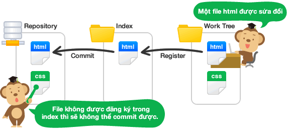

## 1. Nội Dung
#### working tree và index
- Trên Git, những thư mục được đặt trong sự quản lý của Git mà mọi người đang thực hiện công việc trong thực tế được gọi là working tree.



- Và trên Git, giữa repository và working tree tồn tại một nơi gọi là index. Index là nơi để chuẩn bị cho việc commit lên repository.
#### 1.1 Tạo repository
- Trước tiên hãy tạo thư mục tutorial ở nơi tùy ý trên máy. Để đặt 1 thư mục dưới sự quản lý của Git, sử dụng lệnh `init` để di chuyển đến thư mục đó. 

    ````
    $ mkdir tutorial
    $ cd tutorial
    $ git init
    ````
#### 1.2 commit 1 file
- sử dụng lệnh `git add <file>` để đăng ký sự theo giõi của git
 
    ```
    add hihi.txt
    ```
- có thể sử dụng `git add.` để add tất cả các file trong 
- file sau khi được add thì được đưa vào index và chuẩn bị để commit 
- Sử dụng `git commit -m "message"` để commit

    ```shell
    git commit -m "this is the first commit"
    ```
- Sử dụng lệnh `git status` để kiểm tra trạng thái của working tree và index
    ```
    git status
    ```
#### 1.3 cách push/clone remote repository
- sử dụng `git clone <repository> <directory> `  để clone repository đến thư mục directory mà minh muốn
    ```
    git clone https://gitlab.zalopay.vn/namvh3/Linux-Thinking.git
    Linux-Thinking
    ```
- sử dụng `git push <origin>` để cập nhật thay đổi lên remote repository
 #### 1.4 sử dụng stash 
- sử dụng `git tash` để lưu lại các thay đổi chưa commit. thường rất hữu dụng khi bạn muốn đổi sang 1 branch khác mà lại đang làm dở ở branch hiện tại.
    ```
     git stash
    ``` 
    <i>Sau khi đã git stash 1 hoặc vài lần, bạn có thể xem lại danh sách các lần lưu thay đổi bằng câu lệnh</i>

* Nếu muốn xem cả nội dung của từng thay đổi thì thêm option -p
    ```
    git stash list
    ```
* hoặc xem nội dung cụ thể hơn nữa của lần thay đổi thứ 1:
    ```
    git stash show stash@{1}
    ```
* Xoá các thay đổi không cần thiết
    
    ```
    git stash apply stash@{1}
    git stash drop stash@{1}
    ```
* nếu muốn xoá toàn bộ stack thì có thể dùng clear
    ```
    git stash clear
    ```
#### 1.5 làm việc với branch

#### 1.6 các lệnh hữu ích
- Trong trường hợp nếu lỡ tay add 1 file để commit, và bạn nhận ra tên file mình commit bị sai. Git cung cấp lệnh `git mv <tên file cũ> <tên file mới>` để đổi lại tên file đã bị nhập sai. 
    ```
    git mv File.txt file.txt
    ```
